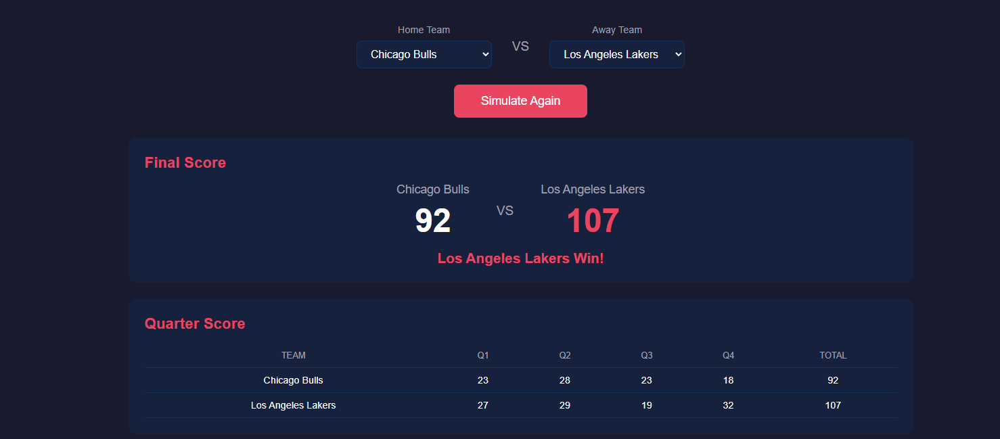
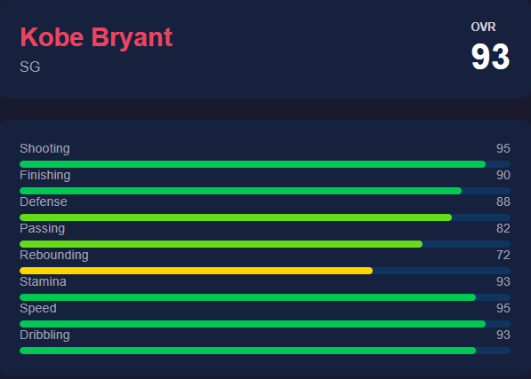
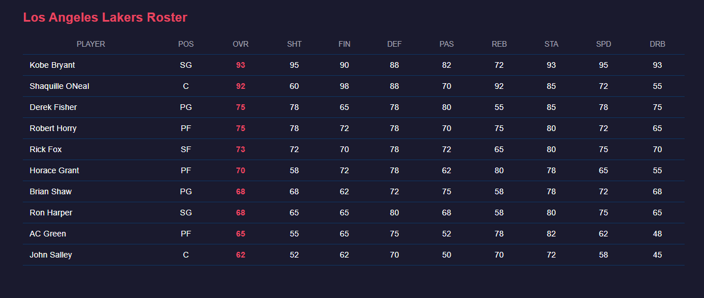

## Getting Started

## Screenshot

### Game Simulation


### Player Profile


### Team Roster


### Prerequisites

- Node.js 18+
- PostgreSQL 14+
- npm

### Installation

**1. Clone the repository:**
```bash
git clone https://github.com/yourusername/airball-architect-sim.git
cd airball-architect-sim
```

**2. Install dependencies:**
```bash
npm install
cd client && npm install
```

**3. Set up environment variables:**

Create a `.env` file in the project root:
```
DB_HOST=localhost
DB_PORT=5432
DB_NAME=airball_architect_sim
DB_USER=postgres
DB_PASSWORD=yourpassword
```


**4. Create the database:**

```bash
psql -U postgres
```
```sql
CREATE DATABASE airball_architect_sim;
\q
```

**5. Run migrations:**

```bash
psql -U postgres -d airball_architect_sim -f migrations/001_create_teams.sql
psql -U postgres -d airball_architect_sim -f migrations/002_create_players.sql
psql -U postgres -d airball_architect_sim -f migrations/003_create_games.sql
```

**6. Seed the database:**
```bash
npm run seed
```

This populates the database with two teams — the Chicago Bulls and Los Angeles Lakers — with historically inspired rosters and ratings, along with a sample game between them ready to simulate.

## Available Scripts

| Command | Description |
|---|---|
| `npm run dev` | Start the Express server in watch mode |
| `npm run build` | Compile TypeScript to JavaScript |
| `npm run seed` | Seed database with Bulls and Lakers rosters |
| `npm run test:sim` | Run a test simulation in the terminal |
